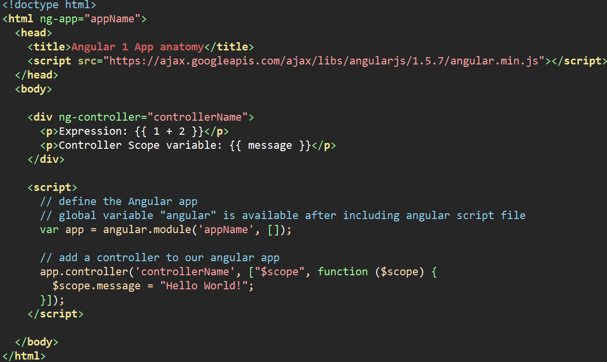

# Lesson 1 - The Basics

- [learn-angular.org](http://learn-angular.org) **NB!** go through this tutorial

## About Angular 1
- JavaScript framework for developing Single Page Applications (SPAs)
- [Angular 1 website](https://angularjs.org)
- [Angular 1 API documentation](https://docs.angularjs.org/api)

## Anatomy of Basic Angular 1 App

- define angular app/module name with **ng-app** directive on html (or body) element
- only ONE [ng-app](https://docs.angularjs.org/api/ng/directive/ngApp) per page! 

- include the angular.min.js script so we can use "angular" to create an app
- define an HTML element "view" for our first angular **controller** which binds our *models* to our *views* (MVC)
- create JavaScript "expressions" using {{double curly braces}} in our view 
- anything inside {{braces}} is evaluated from our controller **$scope** 
- the variables and functions of our controller $scope are available inside our view

