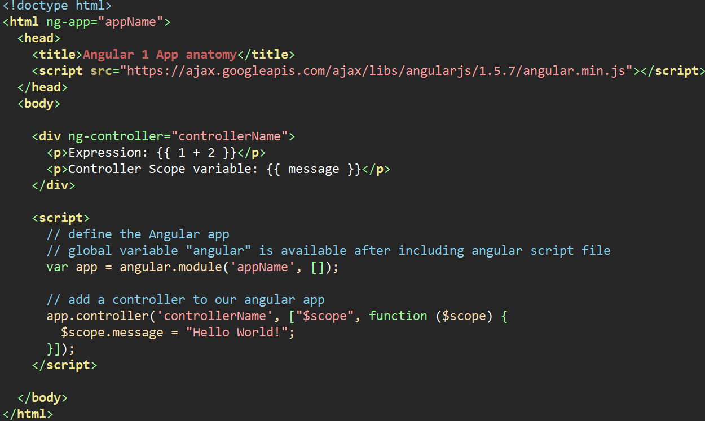

# Lesson 2 - Angular Basics - Forms and Services

- [learn-angular.org](http://learn-angular.org) **NB!** go through this tutorial if you still have not 

## Recap 

#### Anatomy of Basic Angular 1 App

- define angular app/module name with **ng-app** directive on html (or body) element
- only ONE [ng-app](https://docs.angularjs.org/api/ng/directive/ngApp) per page! 

- include the angular.min.js script so we can use "angular" to create an app
- define an HTML element "view" for our first angular **controller** which binds our *models* to our *views* (MVC)
- create JavaScript "expressions" using {{double curly braces}} in our view 
- anything inside {{braces}} is evaluated from our controller **$scope** 
- the variables and functions of our controller $scope are available inside our view

## Angular Concepts 
- [AngularJS Reference](https://docs.angularjs.org/guide/concepts)

### Module
- a container for the different parts of an app including controllers, services, filters, directives which configures the Injector
- example: a calendar module

### View
- what the user sees ([DOM](https://developer.mozilla.org/en-US/docs/Web/API/Document_Object_Model/Introduction) = Document Object Model)
- example: a table of days of the month for the calendar

### Controllers
- the business logic behind views
- example: functionality to add a meeting to the calendar

### Directives
- HTML extended with custom attributes and elements
- example: a <meeting> element which would show the details of the meeting in the calendar

### Services 
- reusable business logic independent of views
- example: an API endpoint to save meeting information in the database

## Exercise - create a form 
### Specification
- Form should accept the following fields: 
- name (required) 
- email (required and validated)
- gender radio buttons for male,female,other (required)
- comment text box
- favourite javascript library select dropdown, items 'please select', angularjs, react, vuejs (required)
- terms and conditions checkbox
- submit button
- appropriate validation messages for required fields and email validation
- save the form to the browser local database (webstorage)
- list the entries below the form
